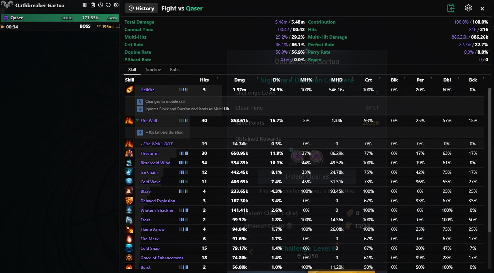
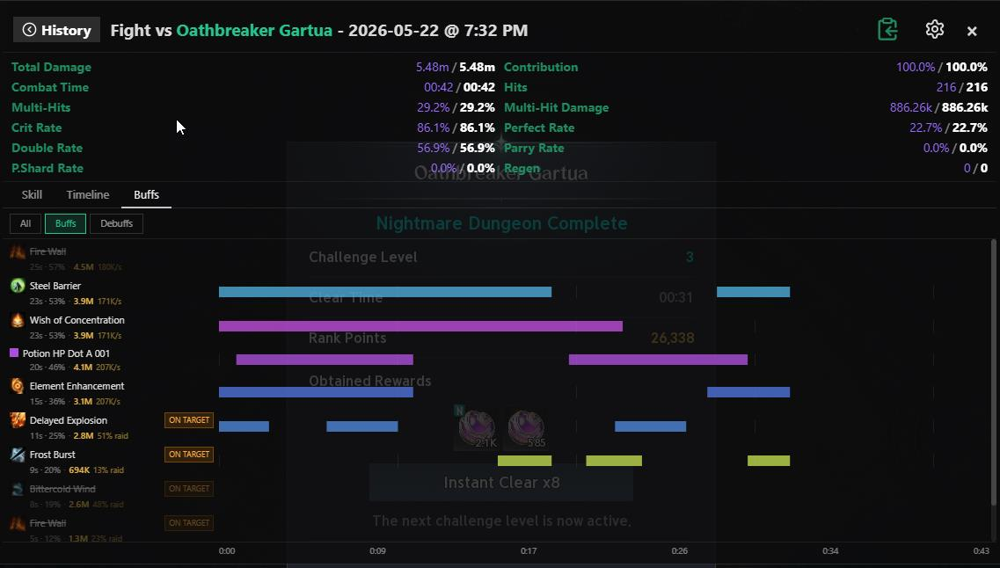
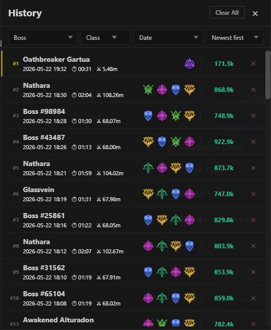

  
  <h1>aion2t.com DPS Meter</h1>
  
Real-time DPS overlay for <strong>Aion 2</strong> (PC client)

  
  
  

  [**⬇ Download v1.1.14**](https://raw.githubusercontent.com/Grachy/aion2t-dps-meter/master/docs/aion2t-dps-setup-1.1.14-x64.exe) · [Website](https://aion2t.com/dps-meter) · [Report a Bug](https://github.com/Grachy/aion2t-dps-meter/issues)

  ---

  🇬🇧 English · [🇷🇺 Русский](#ru) · [🇩🇪 Deutsch](#de) · [🇫🇷 Français](#fr) · [🇪🇸 Español](#es) · [🇧🇷 Português](#pt) · [🇯🇵 日本語](#ja) · [🇰🇷 한국어](#ko) · [🇨🇳 简体中文](#zh-hans) · [🇹🇼 繁體中文](#zh-hant)

---

## What is it?

A lightweight transparent overlay that reads Aion 2 network packets and shows **real-time DPS** for every member of your party — no game files are modified, nothing is injected.

> Works with the **PC (Windows) client** of Aion 2.

## Screenshots

| Skill breakdown | Buff timeline | Fight history |
|:-:|:-:|:-:|
|  |  |  |

## Features

- **Real-time DPS** — updates every 500 ms for all party members
- **Skill breakdown** — click any player to see which skills deal the most damage, with icons, hit counts, crit rates and more
- **Buff timeline** — see which buffs were active and how they affected DPS throughout the fight
- **Fight history** — browse past fights, filter by boss or class, compare your performance
- **Party selector** — switch between multiple parties / instances on the fly
- **Boss tracking** — shows the current boss name and total damage dealt to it
- **Auto-detect local player** — your character is highlighted automatically
- **Always-on-top transparent overlay** — stays visible over the game at any resolution
- **Resizable** — drag any edge to fit your screen layout
- **Hotkey reset** — `Ctrl+R` clears all DPS data and starts fresh
- **10 languages** — English, Русский, Deutsch, Français, Español, Português, 日本語, 한국어, 简体中文, 繁體中文
- **Auto-update** — the app notifies you when a new version is available

## Download & Install 

The meter captures traffic through **Npcap**, so install Npcap once before running it.

### 1. Install Npcap (required)

Download and run the installer from **[npcap.com/#download](https://npcap.com/#download)**.
In the Npcap installer, tick **"Install Npcap in WinPcap API-compatible Mode"** — without it the meter can't find `wpcap.dll` and shows *"Npcap is required for packet capture"*.

### 2. Install the meter

**[⬇ Download aion2t-dps-setup-1.1.14-x64.exe](https://raw.githubusercontent.com/Grachy/aion2t-dps-meter/master/docs/aion2t-dps-setup-1.1.14-x64.exe)**

1. Download the installer above
2. Run it — if Windows SmartScreen appears, click **More info → Run anyway**
3. Launch **aion2t.com DPS** from the Start menu or desktop shortcut
4. Start Aion 2 and enter a dungeon — the overlay populates automatically

| | |
|---|---|
| OS | Windows 10 / 11 (x64) |
| Packet capture | **Npcap** in WinPcap API-compatible mode — [npcap.com](https://npcap.com/#download) |
| Runtime | WebView2 (preinstalled on Windows 10/11 via Microsoft Edge) |
| Network | Must be on the same machine as the Aion 2 client |
| Privileges | Standard user to run the meter; admin only to install Npcap |

## Hotkeys

| Hotkey | Action |
|--------|--------|
| `Ctrl+R` | Reset all DPS data |
| Drag window edge | Resize overlay |

## FAQ

**Q: Will I get banned?**  
A: The meter reads network packets passively — no game files modified, nothing injected. Use at your own discretion.

**Q: The overlay shows no data.**  
A: Make sure **Npcap is installed** (the meter prompts you to download it if it's missing) — then check that Aion 2 is running on the same PC and you are in active combat.

**Q: DPS values look wrong after switching parties.**  
A: Press `Ctrl+R` to reset.

**Q: Windows SmartScreen blocks the installer.**  
A: Click **More info → Run anyway**. No paid code-signing certificate yet.

---

🇷🇺 Русский

## aion2t.com DPS Meter

Лёгкий прозрачный оверлей, который читает сетевые пакеты Aion 2 и показывает **урон в реальном времени** для каждого участника пати — без модификации игровых файлов и без инъекций кода.

**[⬇ Скачать v1.1.14](https://raw.githubusercontent.com/Grachy/aion2t-dps-meter/master/docs/aion2t-dps-setup-1.1.14-x64.exe)**

### Возможности

- **Урон в реальном времени** — обновление каждые 500 мс для всех членов пати
- **Разбивка по скиллам** — нажми на игрока и увидишь статистику каждого скилла: иконки, количество ударов, процент критов и многое другое
- **Тайм-лайн баффов** — какие баффы были активны и как они влияли на урон в течение боя
- **История боёв** — просматривай прошлые бои, фильтруй по боссу или классу
- **Выбор пати** — переключение между несколькими группами/инстансами на лету
- **Отслеживание боссов** — имя текущего босса и суммарный урон по нему
- **Авто-определение своего персонажа** — твой персонаж подсвечивается автоматически
- **Прозрачный оверлей поверх всего** — всегда виден поверх игры, изменяемый размер
- **Горячая клавиша сброса** — `Ctrl+R` сбрасывает все данные ДПС
- **10 языков интерфейса**
- **Авто-обновление** — приложение уведомляет о новых версиях

### Установка

1. **Установи Npcap (обязательно)** — скачай с [npcap.com/#download](https://npcap.com/#download) и при установке отметь галочку **«Install Npcap in WinPcap API-compatible Mode»**. Без неё метр не найдёт `wpcap.dll` и покажет «Npcap is required for packet capture»
2. Скачай установщик метра по ссылке выше и запусти его — если появится SmartScreen, нажми **Подробнее → Выполнить в любом случае**
3. Запусти **aion2t.com DPS** через меню Пуск или ярлык на рабочем столе
4. Запусти Aion 2 и войди в подземелье — оверлей заполнится автоматически

| | |
|---|---|
| ОС | Windows 10 / 11 (x64) |
| Захват пакетов | **Npcap** в режиме WinPcap API-compatible — [npcap.com](https://npcap.com/#download) |
| Сеть | На том же ПК, что и клиент Aion 2 |
| Права | Обычный пользователь для запуска; админ — только для установки Npcap |

---

🇩🇪 Deutsch

## aion2t.com DPS Meter

Ein leichtes transparentes Overlay, das Aion-2-Netzwerkpakete liest und den **Schaden in Echtzeit** für alle Gruppenmitglieder anzeigt — ohne Spielmodifikation, ohne Code-Injection.

**[⬇ Download v1.1.14](https://raw.githubusercontent.com/Grachy/aion2t-dps-meter/master/docs/aion2t-dps-setup-1.1.14-x64.exe)**

### Funktionen

- **Echtzeit-DPS** — Aktualisierung alle 500 ms für alle Gruppenmitglieder
- **Skill-Aufschlüsselung** — Klicke auf einen Spieler, um Statistiken pro Skill zu sehen: Icons, Trefferanzahl, Krit-Rate und mehr
- **Buff-Timeline** — Welche Buffs wann aktiv waren und wie sie den Schaden beeinflussten
- **Kampfverlauf** — Vergangene Kämpfe durchsuchen, nach Boss oder Klasse filtern
- **Gruppen-Auswahl** — Zwischen mehreren Gruppen/Instanzen wechseln
- **Boss-Tracking** — Aktueller Bossname und Gesamtschaden
- **Automatische Spieler-Erkennung** — Dein Charakter wird automatisch hervorgehoben
- **Transparentes Always-on-Top-Overlay** — Immer über dem Spiel sichtbar, frei skalierbar
- **Hotkey-Reset** — `Ctrl+R` setzt alle DPS-Daten zurück
- **10 Sprachen**, Auto-Update

### Installation

1. **Npcap installieren (erforderlich)** — von [npcap.com/#download](https://npcap.com/#download) herunterladen und im Installer **„Install Npcap in WinPcap API-compatible Mode"** anhaken. Sonst findet das Tool `wpcap.dll` nicht und meldet „Npcap is required for packet capture"
2. Meter-Installer herunterladen und ausführen — bei SmartScreen-Warnung: **Weitere Informationen → Trotzdem ausführen**
3. **aion2t.com DPS** über das Startmenü starten
4. Aion 2 starten und einen Dungeon betreten — das Overlay füllt sich automatisch

---

🇫🇷 Français

## aion2t.com DPS Meter

Un overlay transparent léger qui lit les paquets réseau d'Aion 2 et affiche les **DPS en temps réel** pour chaque membre du groupe — sans modifier les fichiers du jeu, sans injection de code.

**[⬇ Télécharger v1.1.14](https://raw.githubusercontent.com/Grachy/aion2t-dps-meter/master/docs/aion2t-dps-setup-1.1.14-x64.exe)**

> ⚠️ **Prérequis : installez [Npcap](https://npcap.com/#download)** en cochant « Install Npcap in WinPcap API-compatible Mode » — sinon le meter ne peut pas capturer les paquets.

### Fonctionnalités

- **DPS en temps réel** — mise à jour toutes les 500 ms pour tous les membres du groupe
- **Détail par compétence** — cliquez sur un joueur pour voir les statistiques de chaque compétence : icônes, nombre de coups, taux de critique, etc.
- **Chronologie des buffs** — quels buffs étaient actifs et leur impact sur les DPS
- **Historique des combats** — parcourez les combats passés, filtrez par boss ou classe
- **Sélecteur de groupe** — basculer entre plusieurs groupes/instances à la volée
- **Suivi du boss** — nom du boss actuel et dégâts totaux infligés
- **Détection automatique du personnage** — votre personnage est mis en évidence automatiquement
- **Overlay transparent Always-on-Top** — toujours visible au-dessus du jeu, redimensionnable
- **Raccourci reset** — `Ctrl+R` remet à zéro les données DPS
- **10 langues**, mise à jour automatique

---

🇪🇸 Español

## aion2t.com DPS Meter

Un overlay transparente ligero que lee los paquetes de red de Aion 2 y muestra el **DPS en tiempo real** para cada miembro del grupo — sin modificar archivos del juego, sin inyección de código.

**[⬇ Descargar v1.1.14](https://raw.githubusercontent.com/Grachy/aion2t-dps-meter/master/docs/aion2t-dps-setup-1.1.14-x64.exe)**

> ⚠️ **Requisito: instala [Npcap](https://npcap.com/#download)** marcando «Install Npcap in WinPcap API-compatible Mode» — sin él el meter no puede capturar paquetes.

### Características

- **DPS en tiempo real** — actualización cada 500 ms para todos los miembros del grupo
- **Desglose por habilidades** — haz clic en un jugador para ver estadísticas por habilidad: iconos, golpes, tasa de crítico y más
- **Línea de tiempo de buffs** — qué buffs estaban activos y cómo afectaron al DPS
- **Historial de combates** — consulta combates anteriores, filtra por jefe o clase
- **Selector de grupo** — cambia entre varios grupos/instancias al vuelo
- **Seguimiento de jefes** — nombre del jefe actual y daño total infligido
- **Detección automática del jugador** — tu personaje se resalta automáticamente
- **Overlay transparente siempre visible** — siempre encima del juego, redimensionable
- **Atajo de reinicio** — `Ctrl+R` borra todos los datos de DPS
- **10 idiomas**, actualización automática

---

🇧🇷 Português

## aion2t.com DPS Meter

Um overlay transparente leve que lê os pacotes de rede do Aion 2 e exibe o **DPS em tempo real** para cada membro do grupo — sem modificar arquivos do jogo, sem injeção de código.

**[⬇ Baixar v1.1.14](https://raw.githubusercontent.com/Grachy/aion2t-dps-meter/master/docs/aion2t-dps-setup-1.1.14-x64.exe)**

> ⚠️ **Pré-requisito: instale o [Npcap](https://npcap.com/#download)** marcando "Install Npcap in WinPcap API-compatible Mode" — sem ele o meter não captura pacotes.

### Funcionalidades

- **DPS em tempo real** — atualização a cada 500 ms para todos os membros do grupo
- **Detalhamento por habilidade** — clique em um jogador para ver estatísticas por habilidade: ícones, acertos, taxa de crítico e mais
- **Linha do tempo de buffs** — quais buffs estavam ativos e como afetaram o DPS
- **Histórico de combates** — veja combates anteriores, filtre por chefe ou classe
- **Seletor de grupo** — alterne entre vários grupos/instâncias
- **Rastreamento de chefe** — nome do chefe atual e dano total causado
- **Detecção automática do jogador** — seu personagem é destacado automaticamente
- **Overlay transparente sempre visível** — sempre sobre o jogo, redimensionável
- **Atalho de reset** — `Ctrl+R` limpa todos os dados de DPS
- **10 idiomas**, atualização automática

---

🇯🇵 日本語

## aion2t.com DPS Meter

Aion 2のネットワークパケットを読み取り、パーティ全員の**リアルタイムDPS**を表示する軽量透明オーバーレイ — ゲームファイルの変更なし、コードインジェクションなし。

**[⬇ ダウンロード v1.1.14](https://raw.githubusercontent.com/Grachy/aion2t-dps-meter/master/docs/aion2t-dps-setup-1.1.14-x64.exe)**

> ⚠️ **前提条件：[Npcap](https://npcap.com/#download) をインストール**してください（インストール時に「Install Npcap in WinPcap API-compatible Mode」にチェック）。これがないとパケットを取得できません。

### 機能

- **リアルタイムDPS** — 全メンバーのダメージを500msごとに更新
- **スキル別内訳** — プレイヤーをクリックしてスキルごとの統計を確認：アイコン、ヒット数、クリット率など
- **バフタイムライン** — どのバフが有効で、DPSにどう影響したかを確認
- **戦闘履歴** — 過去の戦闘を閲覧、ボスやクラスでフィルタリング
- **パーティ選択** — 複数のパーティ/インスタンスを切り替え
- **ボストラッキング** — 現在のボス名と合計ダメージを表示
- **自キャラ自動検出** — 自分のキャラクターが自動でハイライト
- **透明常時最前面オーバーレイ** — ゲームの上に常時表示、サイズ変更可能
- **ホットキーリセット** — `Ctrl+R`でDPSデータをリセット
- **10言語対応**、自動アップデート

---

🇰🇷 한국어

## aion2t.com DPS Meter

Aion 2의 네트워크 패킷을 읽어 파티 전원의 **실시간 DPS**를 표시하는 가벼운 투명 오버레이 — 게임 파일 수정 없음, 코드 주입 없음.

**[⬇ 다운로드 v1.1.14](https://raw.githubusercontent.com/Grachy/aion2t-dps-meter/master/docs/aion2t-dps-setup-1.1.14-x64.exe)**

> ⚠️ **필수: [Npcap](https://npcap.com/#download) 설치** — 설치 시 "Install Npcap in WinPcap API-compatible Mode"에 체크하세요. 없으면 패킷을 캡처할 수 없습니다.

### 기능

- **실시간 DPS** — 전체 파티원의 피해량을 500ms마다 업데이트
- **스킬별 분석** — 플레이어 클릭 시 스킬별 통계 확인: 아이콘, 히트 수, 치명타율 등
- **버프 타임라인** — 어떤 버프가 활성화되었고 DPS에 어떤 영향을 미쳤는지 확인
- **전투 기록** — 과거 전투 열람, 보스 또는 직업으로 필터링
- **파티 선택** — 여러 파티/인스턴스 간 전환
- **보스 추적** — 현재 보스 이름과 총 피해량 표시
- **내 캐릭터 자동 감지** — 내 캐릭터가 자동으로 강조 표시됨
- **투명 항상 위 오버레이** — 게임 위에 항상 표시, 크기 조절 가능
- **핫키 초기화** — `Ctrl+R`로 DPS 데이터 초기화
- **10개 언어 지원**, 자동 업데이트

---

🇨🇳 简体中文

## aion2t.com DPS Meter

一款轻量级透明覆盖工具，通过读取 Aion 2 网络数据包，实时显示队伍中每位成员的**DPS** — 不修改游戏文件，不注入代码。

**[⬇ 下载 v1.1.14](https://raw.githubusercontent.com/Grachy/aion2t-dps-meter/master/docs/aion2t-dps-setup-1.1.14-x64.exe)**

> ⚠️ **前置要求：安装 [Npcap](https://npcap.com/#download)**，安装时勾选 “Install Npcap in WinPcap API-compatible Mode”，否则无法捕获数据包。

### 功能

- **实时 DPS** — 每 500ms 更新全队伤害数据
- **技能详情** — 点击玩家查看每个技能的统计：图标、命中次数、暴击率等
- **增益时间轴** — 查看哪些增益处于激活状态以及对 DPS 的影响
- **战斗历史** — 浏览过去的战斗记录，按 Boss 或职业筛选
- **队伍选择** — 快速切换多个队伍/副本
- **Boss 追踪** — 显示当前 Boss 名称和累计伤害
- **自动识别本地玩家** — 自动高亮显示自己的角色
- **透明置顶覆盖层** — 始终显示在游戏上方，可自由调整大小
- **快捷键重置** — `Ctrl+R` 清除所有 DPS 数据
- **10 种语言**，自动更新

---

🇹🇼 繁體中文

## aion2t.com DPS Meter

一款輕量級透明覆蓋工具，透過讀取 Aion 2 網路封包，即時顯示隊伍中每位成員的**DPS** — 不修改遊戲檔案，不注入程式碼。

**[⬇ 下載 v1.1.14](https://raw.githubusercontent.com/Grachy/aion2t-dps-meter/master/docs/aion2t-dps-setup-1.1.14-x64.exe)**

> ⚠️ **前置需求：安裝 [Npcap](https://npcap.com/#download)**，安裝時勾選「Install Npcap in WinPcap API-compatible Mode」，否則無法擷取封包。

### 功能

- **即時 DPS** — 每 500ms 更新全隊傷害數據
- **技能詳情** — 點擊玩家查看每個技能的統計：圖示、命中次數、暴擊率等
- **增益時間軸** — 查看哪些增益處於激活狀態以及對 DPS 的影響
- **戰鬥歷史** — 瀏覽過去的戰鬥記錄，依 Boss 或職業篩選
- **隊伍選擇** — 快速切換多個隊伍/副本
- **Boss 追蹤** — 顯示當前 Boss 名稱和累計傷害
- **自動辨識本地玩家** — 自動高亮顯示自己的角色
- **透明置頂覆蓋層** — 始終顯示在遊戲上方，可自由調整大小
- **快捷鍵重置** — `Ctrl+R` 清除所有 DPS 資料
- **10 種語言**，自動更新

---

  Made with ❤️ by <a href="https://aion2t.com/dps-meter">aion2t.com/dps-meter</a>

